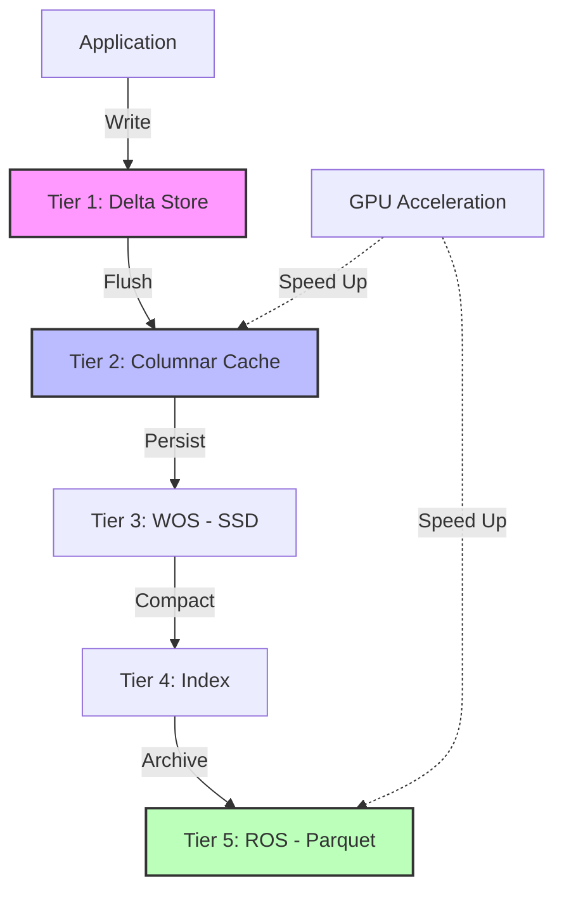

# DBX — Next-Generation HTAP Embedded Database
{: .fs-9 }

[](https://github.com/ByteLogicCore/DBX)
[](LICENSE)
[](https://www.rust-lang.org)
[](https://bytelogiccore-spec.github.io/DBX/)

**DBX** is a high-performance, embedded database designed for modern **HTAP (Hybrid Transactional/Analytical Processing)** workloads. Built with a unique **5-Tier Hybrid Storage** architecture, it bridges the gap between ultra-fast in-memory transactions and massive-scale columnar analytics.
{: .fs-6 .fw-300 }

---

## ⚡ The DBX Edge: Why Choose Us?

### 🚄 1. Infinite Scalability (5-Tier Architecture)
Unlike traditional databases that force a choice between speed and capacity, DBX flows data through 5 specialized tiers:
- **Tier 1 (Delta)**: Ultra-fast BTreeMap for sub-millisecond writes.
- **Tier 2 (Cache)**: Apache Arrow-based columnar cache for instant OLAP.
- **Tier 3 (WOS)**: SSD-optimized MVCC storage for snapshot isolation.
- **Tier 4 (Index)**: High-speed Bloom filters for near-zero latency probes.
- **Tier 5 (ROS)**: Compact Parquet storage for petabyte-scale archiving.

### 🏎️ 2. Blazing Fast Performance
Benchmark results (10,000 records) show DBX outperforming industry standards:
- **File GET**: **29x faster** than SQLite (17ms vs 497ms) 🔥
- **Memory INSERT**: **1.16x faster** than SQLite (25ms vs 29ms) ✅

### 🧠 3. GPU-Native Analytics
DBX is the first embedded database to offer **first-class CUDA acceleration**.
- **4.5x faster** filtering and aggregation on large datasets.
- Seamlessly offload heavy JOINs and GROUP BY operations to the GPU.

### 🛡️ 4. Zero-Lock Concurrency (MVCC)
Handle massive concurrent workloads without blocking.
- **Snapshot Isolation**: Readers never block writers, and writers never block readers.
- **ACID Compliant**: Full transactional integrity with WAL 2.0.

---

## 📦 Modern Capabilities

### 💎 Materialized Views
Define complex analytical queries and let DBX handle the heavy lifting.
- **Auto-Refresh**: Background threads keep your results fresh every 60 seconds.
- **Transparent Caching**: SQL queries hit the cache automatically for instant responses.

### 🌊 Real-time Streaming (CDC)
Built-in `StreamIngester` for high-throughput data pipelines.
- **MPSC Pipeline**: Concurrently ingest from thousands of producers.
- **Full DML Support**: Real-time INSERT, UPDATE, and DELETE processing.

---

## 🏗️ Architecture Visualization



---

## 🚀 Quick Start (Rust)

```rust
use dbx_core::Database;

fn main() -> dbx_core::DbxResult<()> {
    // Open a database in memory or on disk
    let db = Database::open_in_memory()?;

    // Lightning-fast CRUD
    db.insert("users", b"user:123", b"{\"name\": \"Alice\", \"age\": 30}")?;
    let val = db.get("users", b"user:123")?;

    // Powerful HTAP SQL
    let results = db.execute_sql("SELECT name, AVG(age) FROM users GROUP BY name")?;

    Ok(())
}
```

---

## 🤝 Support & Contributing

DBX is an open-source project powered by the community.
- ⭐️ **Star us** on GitHub to show your support!
- 🐛 **Report issues** or request features via GitHub Issues.
- 🛠️ **Contribute**: Check our [Contributing Guide](./legal/english/CONTRIBUTING.md) for build optimizations (LLD, mold, etc.).

---

**Made with ❤️ in Rust for the Future of Data.**
