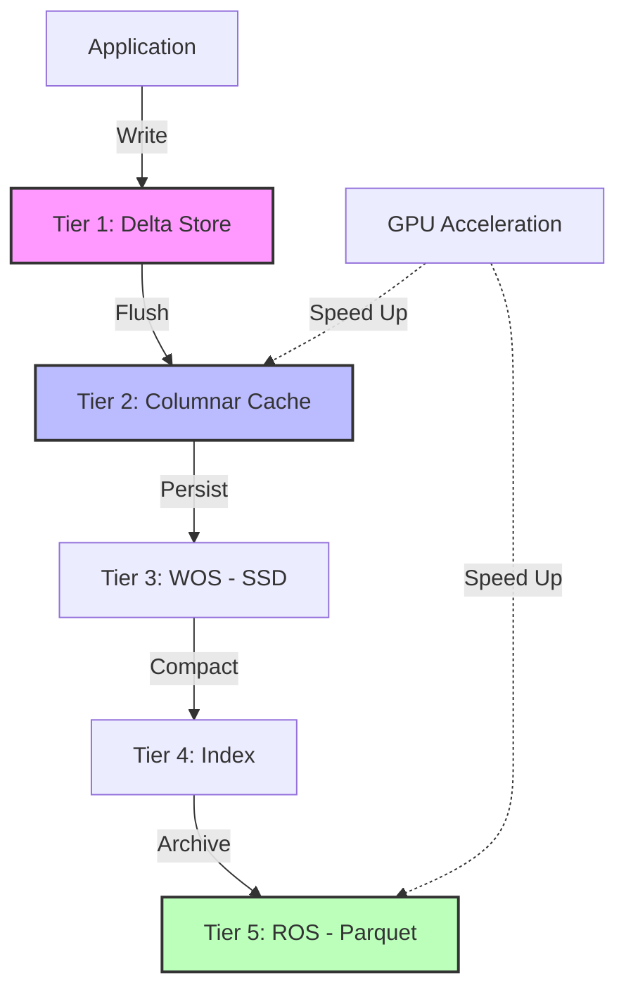

# DBX — Next-Generation HTAP Embedded Database
{: .fs-9 }

[](https://github.com/ByteLogicCore/DBX)
[](LICENSE)
[](https://www.rust-lang.org)
[](https://bytelogiccore-spec.github.io/DBX/)

### 💖 Support This Project
If you find DBX useful, please consider supporting its development!

[](https://ko-fi.com/YOUR_KO_FI_LINK)

Your support helps with:
- 🚀 New features and performance optimizations
- 🐛 Bug fixes and stability improvements
- 📚 Documentation and tutorials
- 💻 Test infrastructure and CI/CD maintenance

---

**DBX** is a high-performance, embedded database designed for modern **HTAP (Hybrid Transactional/Analytical Processing)** workloads. Built with a unique **5-Tier Hybrid Storage** architecture, it bridges the gap between ultra-fast in-memory transactions and massive-scale columnar analytics.
{: .fs-6 .fw-300 }

---

## ⚡ The DBX Edge: Why Choose Us?

### 🚄 1. Infinite Scalability (5-Tier Architecture)
Unlike traditional databases that force a choice between speed and capacity, DBX flows data through 5 specialized tiers:
- **Tier 1 (Delta)**: Ultra-fast BTreeMap for sub-millisecond writes.
- **Tier 2 (Cache)**: Apache Arrow-based columnar cache for instant OLAP.
- **Tier 3 (WOS)**: SSD-optimized MVCC storage for snapshot isolation.
- **Tier 4 (Index)**: High-speed Bloom filters for near-zero latency probes.
- **Tier 5 (ROS)**: Compact Parquet storage for petabyte-scale archiving.

### 🏎️ 2. Blazing Fast Performance
Benchmark results (10,000 records) show DBX outperforming industry standards with the new **Fast-Path** optimization (v0.2.0):
- **Local Scan**: **51µs (microseconds)** — Ultra-low latency via local bypass 🔥
- **Memory INSERT**: **1.16x faster** than SQLite (25ms vs 29ms) ✅
- **Analytics (OLAP)**: **Up to 29x faster** than traditional B-Tree engines.

### 🧠 3. GPU-Native Analytics
DBX is the first embedded database to offer **first-class CUDA acceleration**.
- **4.5x faster** filtering and aggregation on large datasets.
- Seamlessly offload heavy JOINs and GROUP BY operations to the GPU.

### ⚡ Zero-Lock Concurrency (MVCC) + Distributed Locks (DLM)
Readers never block writers, and writers never block readers.
Equipped with a **Network-Aware Distributed Lock Manager (DLM)** that uses Fencing Tokens and Adaptive Leases via `GridDatabaseAsync`, while strictly preserving single-node HTAP latency.
- Built-in absolute **Atomic CAS operations** (`insert_if_not_exists`, `compare_and_swap`).
- Super-fast 1024-Striped **Row-level Latch Lock Manager**, removing heavy table mutexes from the main data store. (Providing blazing-fast concurrent operations across 5 tiers without table-level bottlenecks).
  *(Disclaimer: Secondary Index updates currently utilize standard `RwLock` for tree integrity, resulting in brief column-level locks during write-heavy index operations.)*

### 🌐 5. Distributed Grid Architecture (Grid Engine)
A **Data Grid** is a distributed computing architecture where multiple machines connected over a network act as **one unified database**. DBX has this grid engine built-in, allowing you to start as a single-node embedded DB and — without any code changes — scale horizontally across networked nodes.

> **💡 Why Grid?** Traditional embedded databases (SQLite, Sled, etc.) are confined to a single process. DBX is the **only embedded database** capable of real-time data replication and distribution across nodes over the network.

- **Network Replication (QUIC Transport)**: Ultra-low latency data replication between nodes via TLS 1.3 QUIC protocol. Zero Head-of-Line Blocking ensures stability even in large clusters.
- **Quorum-based High Availability**: Raft-like leader election with majority ACK approval ensures data consistency and service continuity even when some nodes go down.
- **Multi-Master Failover**: Automatic leader election on failure with Vector Clock-based conflict resolution to maintain data integrity.
- **Auto-Sharding (Cross-Node)**: Data is automatically distributed across nodes. Adding a node triggers automatic rebalancing, scaling capacity and throughput linearly.
- **Distributed Transactions (2PC)**: Transactions spanning multiple nodes are guaranteed atomic via Two-Phase Commit.

---

## 📦 Modern Capabilities

### 💎 Materialized Views
Define complex analytical queries and let DBX handle the heavy lifting.
- **Auto-Refresh**: Background threads keep your results fresh every 60 seconds.
- **Transparent Caching**: SQL queries hit the cache automatically for instant responses.

### 🌊 Real-time Streaming (CDC)
Built-in `StreamIngester` for high-throughput data pipelines.
- **MPSC Pipeline**: Concurrently ingest from thousands of producers.
- **Full DML Support**: Real-time INSERT, UPDATE, and DELETE processing.

---

## 🦀 Rust Ecosystem Compatibility

DBX is designed to integrate seamlessly with the modern Rust data ecosystem.
- **Native Serde Support**: Store and retrieve custom Rust `struct`s directly without manual byte conversions via the `DatabaseSerde` trait.
- **Async First Driver**: A non-blocking wrapper `DatabaseAsync` seamlessly offloads heavy I/O to `tokio::task::spawn_blocking`, making it perfect for heavily concurrent async web servers.

---

## 🏗️ Architecture Visualization



---

## 🚀 Quick Start (Rust)

```rust
use dbx_core::Database;

fn main() -> dbx_core::DbxResult<()> {
    // Open a database in memory or on disk
    let db = Database::open_in_memory()?;

    // Lightning-fast CRUD
    db.insert("users", b"user:123", b"{\"name\": \"Alice\", \"age\": 30}")?;
    let val = db.get("users", b"user:123")?;

    // Powerful HTAP SQL
    let results = db.execute_sql("SELECT name, AVG(age) FROM users GROUP BY name")?;

    Ok(())
}
```

---

## 🤝 Support & Contributing

DBX is an open-source project powered by the community.
- ⭐️ **Star us** on GitHub to show your support!
- 🐛 **Report issues** or request features via GitHub Issues.
- 🛠️ **Contribute**: Check our [Contributing Guide](./legal/english/CONTRIBUTING.md) for build optimizations (LLD, mold, etc.).

---

**Made with ❤️ in Rust for the Future of Data.**
