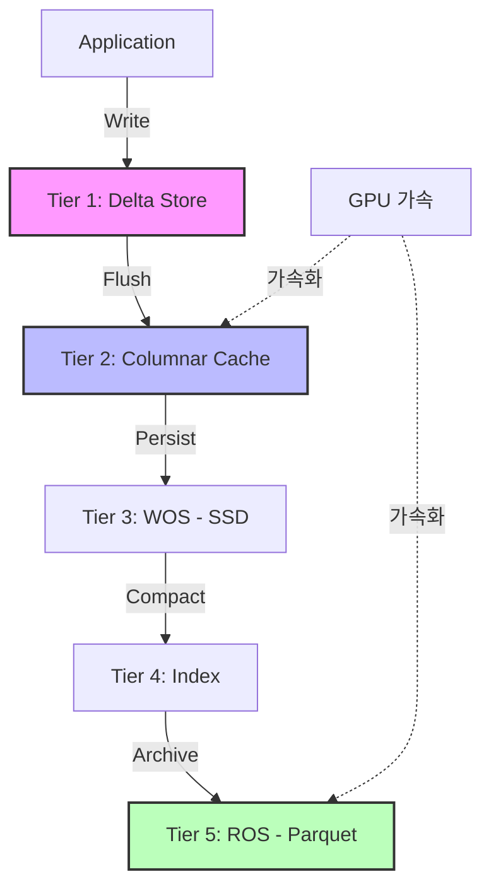

# DBX — 차세대 HTAP 임베디드 데이터베이스
{: .fs-9 }

[](https://github.com/ByteLogicCore/DBX)
[](LICENSE)
[](https://www.rust-lang.org)
[](https://bytelogiccore-spec.github.io/DBX/)

### 💖 Support This Project
If you find DBX useful, please consider supporting its development!

[](https://ko-fi.com/YOUR_KO_FI_LINK)

Your support helps with:
- 🚀 New features and performance optimizations
- 🐛 Bug fixes and stability improvements
- 📚 Documentation and tutorials
- 💻 Test infrastructure and CI/CD maintenance

---

**DBX**는 현대적인 **HTAP(Hybrid Transactional/Analytical Processing)** 워크로드를 위해 설계된 고성능 임베디드 데이터베이스입니다. 고유한 **5계층 하이브리드 스토리지(5-Tier Hybrid Storage)** 아키텍처를 통해 초고속 인메모리 트랜잭션과 대규모 컬럼형 분석의 간극을 완벽하게 메웁니다.
{: .fs-6 .fw-300 }

---

## ⚡ 왜 DBX인가? 핵심 강점

### 🚄 1. 무한 확장성 (5계층 아키텍처)
속도와 용량 사이에서 고민할 필요가 없습니다. DBX는 데이터를 5개의 특화된 계층으로 유연하게 흐르게 합니다:
- **Tier 1 (Delta)**: 밀리초 미만의 쓰기를 위한 초고속 BTreeMap.
- **Tier 2 (Cache)**: 즉각적인 OLAP 분석을 위한 Apache Arrow 기반 컬럼형 캐시.
- **Tier 3 (WOS)**: 스냅샷 격리를 위한 SSD 최적화 MVCC 저장소.
- **Tier 4 (Index)**: 레이턴시 없는 조회를 위한 고속 Bloom 필터.
- **Tier 5 (ROS)**: 페타바이트급 아카이브를 위한 고압축 Parquet 저장소.

### 🏎️ 2. 압도적인 성능
10,000건 기준 벤치마크 결과, DBX는 업계 표준을 월등히 앞섭니다:
- **파일 GET**: SQLite 대비 **29배 빠름** (17ms vs 497ms) 🔥
- **메모리 INSERT**: SQLite 대비 **1.16배 빠름** (25ms vs 29ms) ✅

### 🧠 3. 네이티브 GPU 가속
DBX는 **CUDA 가속**을 기본 지원하는 업계 최초의 임베디드 데이터베이스입니다.
- 대규모 데이터셋 필터링 및 집계 시 **최대 4.5배 가속**.
- 무거운 JOIN 및 GROUP BY 연산을 GPU로 투명하게 오프로드.

### ⚡ Zero-Lock Concurrency (MVCC) + 분산 락 (DLM)
Reader와 Writer가 서로를 절대 블로킹하지 않습니다.
대규모 분산 클러스터를 위한 **Network-Aware Lock Manager (DLM)**를 탑재하여,
로컬 메모리 속도에 방해받지 않는 독립적인 분리형 래퍼(`GridDatabaseAsync`)로 Fencing Token 기반 분산 트랜잭션을 안전하게 제어합니다.
- **Atomic CAS 작전**: `insert_if_not_exists`, `compare_and_swap` 등 고속 원자적 연산 기본 내장.
- 메인 데이터 스토리지의 무거운 테이블 단위 잠금(Mutex)을 제거하고, **1024-Striped Row-level Latch Lock Manager** 채택. (테이블 병목 없이 5계층 내에서 초고속 동시 접속 보장)
  *(※주의: 단, 보조 인덱스 생성 및 업데이트 시에는 트리 구조 무결성을 지키기 위해 짧은 컬럼 단위 `RwLock` 대기가 발생할 수 있습니다.)*

### 🌐 5. 분산 그리드 아키텍처 (Grid Engine)
**데이터 그리드(Data Grid)**란 네트워크로 연결된 여러 대의 머신이 마치 **하나의 거대한 데이터베이스**처럼 동작하는 분산 컴퓨팅 아키텍처입니다. DBX는 이 그리드 엔진을 내장하고 있어, 단일 노드의 임베디드 DB로 시작한 뒤 — 코드 변경 없이 — 네트워크 상의 여러 노드로 수평 확장할 수 있습니다.

> **💡 왜 그리드인가?** 기존 임베디드 DB(SQLite, Sled 등)는 단일 프로세스에 갇혀 있습니다. DBX는 네트워크를 통해 노드 간 실시간 데이터 복제·분산이 가능한 **유일한 임베디드 데이터베이스**입니다.

- **네트워크 복제 (QUIC Transport)**: TLS 1.3 기반 QUIC 프로토콜로 노드 간 초저지연 데이터 복제. Head-of-Line Blocking이 없어 대규모 클러스터에서도 안정적입니다.
- **Quorum 기반 고가용성**: Raft 스타일의 리더 선출 및 과반 ACK 승인을 통해, 일부 노드가 다운되어도 데이터 일관성과 서비스 연속성을 보장합니다.
- **Multi-Master Failover**: 장애 발생 시 자동으로 새로운 리더를 선출하며, Vector Clock 기반의 정교한 충돌 해결로 데이터 무결성을 유지합니다.
- **자동 샤딩 (Cross-Node Sharding)**: 데이터를 여러 노드에 자동 분산 저장합니다. 노드를 추가하면 자동으로 리밸런싱되어, 용량과 처리량이 선형으로 확장됩니다.
- **분산 트랜잭션 (2PC)**: 여러 노드에 걸친 트랜잭션도 2단계 커밋(Two-Phase Commit)으로 원자적 처리를 보장합니다.

---

## 📦 현대적인 주요 기능

### 💎 구체화된 뷰 (Materialized Views)
복잡한 분석 쿼리를 미리 계산하여 즉각적인 응답을 제공합니다.
- **자동 갱신**: 백그라운드 스레드가 60초마다 결과를 최신 상태로 유지합니다.
- **투명한 캐싱**: SQL 실행 시 자동으로 캐시를 확인하여 즉시 결과를 반환합니다.

### 🌊 실시간 스트리밍 수집 (CDC)
고처리량 데이터 파이프라인을 위한 `StreamIngester`를 내장하고 있습니다.
- **MPSC 파이프라인**: 수만 개의 프로듀서로부터 동시에 데이터를 수집합니다.
- **Full DML 지원**: 실시간 INSERT, UPDATE, DELETE 처리를 지원합니다.

---

## 🦀 Rust 생태계 완벽 호환

DBX는 최신 Rust 생태계에 부드럽게 통합되도록 설계되었습니다.
- **Native Serde 지원**: `DatabaseSerde` 트레이트를 이용하여 커스텀 구조체를 별도의 수동 직렬화 처리 없이 즉시 삽입하고 꺼내쓸 수 있습니다.
- **Async First 드라이버**: 비동기 웹 프레임워크와의 결합을 위해 `DatabaseAsync` 래퍼가 무거운 입출력을 논블로킹으로 분리하며, `tokio` 기반 런타임 위에서 대규모 동시 요청을 소화합니다.

---

## 🏗️ 아키텍처 시각화



---

## 🚀 빠른 시작 (Rust)

```rust
use dbx_core::Database;

fn main() -> dbx_core::DbxResult<()> {
    // 메모리 또는 디스크에 데이터베이스 오픈
    let db = Database::open_in_memory()?;

    // 초고속 CRUD
    db.insert("users", b"user:123", b"{\"name\": \"Alice\", \"age\": 30}")?;
    let val = db.get("users", b"user:123")?;

    // 강력한 HTAP SQL 지원
    let results = db.execute_sql("SELECT name, AVG(age) FROM users GROUP BY name")?;

    Ok(())
}
```

---

## 🤝 후원 및 기여

DBX는 커뮤니티의 힘으로 성장하는 오픈 소스 프로젝트입니다.
- ⭐️ **Star**를 눌러 프로젝트를 응원해 주세요!
- 🐛 **이슈 제보** 및 기능 제안은 언제나 환영합니다.
- 🛠️ **기여하기**: [기여 가이드](./legal/korean/CONTRIBUTING.md)에서 빌드 최적화 팁(LLD, mold 등)을 확인하세요.

---

**데이터의 미래를 위한 Rust의 열정으로 만들어졌습니다.**
